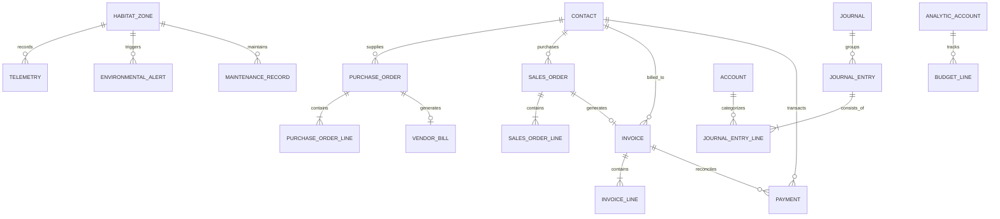

# Database Schema & Relational Design

The database layer consists of **27 relational tables** managed through versioned Flyway migrations (`V1` through `V7`) under `src/main/resources/db/migration/`.

---

## 🗂️ Flyway Migration Sequence

| Version | Migration Script | Description |
|---|---|---|
| `V1` | `V1__init_schema.sql` | Core user identity, RBAC roles, contact directory, and habitat zones |
| `V2` | `V2__environmental_telemetry.sql` | Telemetry logs, thresholds, alerts, and actuator event audit |
| `V3` | `V3__inventory_and_maintenance.sql` | Consumable inventory reserves, stock movements, and maintenance logs |
| `V4` | `V4__commercial_procurement.sql` | Product catalog, purchase orders, purchase lines, and vendor bills |
| `V5` | `V5__sales_and_billing.sql` | Sales orders, sales order lines, customer invoices, and invoice lines |
| `V6` | `V6__double_entry_accounting.sql` | Chart of accounts, journals, journal entries, and analytic accounts |
| `V7` | `V7__budgets_and_seed_data.sql` | Fiscal year operating budgets and initial baseline master data |

---

## 📊 Relational Entity Overview

---

## ⚖️ Strict Double-Entry Ledger Enforcements

The General Ledger enforces two non-negotiable accounting constraints on every database write:
1. **Zero-Balance Requirement:** Every journal entry must contain at least one debit line and one credit line such that:
   $$\sum \text{Debit} - \sum \text{Credit} = 0$$
   Unbalanced postings are rejected by `AccountingEngineService` before transaction commit.
2. **Immutability of Posted Entries:** Journal entries with status `POSTED` cannot be modified or deleted. Adjustments require explicit offsetting reversal entries.
