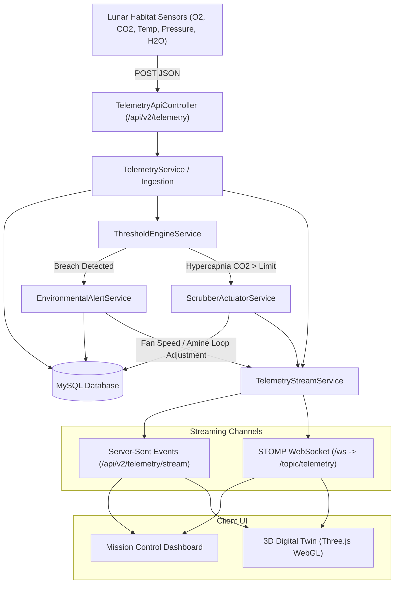

# Real-Time Telemetry & Event Streaming

The Lunar Habitat platform features a low-latency real-time pipeline that distributes sensor metrics, actuator responses, and environmental threshold alerts to Mission Control and the 3D Digital Twin.

---

## ⚡ Telemetry & Actuation Pipeline

---

## 📡 Streaming Protocols

### 1. Server-Sent Events (SSE)
- **Endpoint:** `GET /api/v2/telemetry/stream`
- **Format:** `text/event-stream`
- **Payload:** Serialized `TelemetryV2Response` JSON objects broadcasted whenever new sensor readings are recorded or simulated.
- **Client Handling:** Consumed via the browser's native `EventSource` API with automatic reconnection logic.

### 2. Spring STOMP WebSockets
- **Handshake Endpoint:** `http://localhost:8081/ws` (with SockJS fallback)
- **Subscription Topic:** `/topic/telemetry`
- **Application Broker Prefix:** `/app`
- **Features:** Supports bi-directional operator commands and broadcast state updates.
