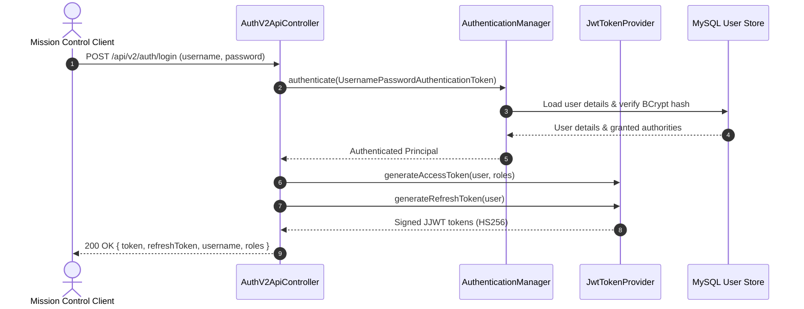

# Security Architecture & Cryptographic Policies

The security infrastructure is built upon **Spring Security 6.x** and **Java JSON Web Token (JJWT 0.12.6)**, implementing defense-in-depth across authentication, authorization, session management, and credential protection.

---

## 🛡️ Authentication Architecture

---

## 🔒 Cryptographic Token Details

- **Algorithm:** HMAC-SHA256 (`HmacSHA256`) using a cryptographically secure key of at least 256 bits (`Keys.hmacShaKeyFor`).
- **Access Token Lifetime:** 30 minutes (1800 seconds).
- **Refresh Token Lifetime:** 7 days (604,800 seconds).
- **Token Blacklisting & Revocation:** Upon `POST /api/v2/auth/logout`, the active JWT token is stored in a thread-safe revocation registry (`revokedTokens`). Subsequent requests presenting the revoked token are immediately rejected with `HTTP 401 Unauthorized`.
- **Tampered Token Handling:** Any modification to JWT header, payload claims, or signature triggers JJWT signature validation failure, resulting in an unauthenticated rejection without exposing backend exceptions.

---

## 👥 Role-Based Access Control (RBAC)

| Role | Permissions & Scope |
|---|---|
| `ROLE_ADMIN` | Full access to users, roles, Chart of Accounts, threshold settings, and system configuration |
| `ROLE_HABITAT_OPERATOR` | Ingest sensor telemetry, acknowledge & resolve alerts, schedule equipment maintenance |
| `ROLE_ACCOUNTANT` | Create & approve purchase orders, post bills/invoices to GL, record disbursements, track budgets |
| `ROLE_TENANT_USER` | View allocated resource consumption, inspect invoices and utility charges |
| `ROLE_VIEWER` | Read-only executive dashboard and audit viewing |

---

## ⚙️ Production Deployment Security Policies

1. **Environment Variable Injection:**
   - Database credentials must be injected via `DB_URL`, `DB_USERNAME`, and `DB_PASSWORD`.
   - JWT secret must be injected via `JWT_SECRET`.
   - No `.env` or plaintext credentials are to be stored in version control.
2. **CORS Hardening:**
   - In production, specify explicit allowed origins in `SecurityConfig.java` matching the deployed frontend domain.
