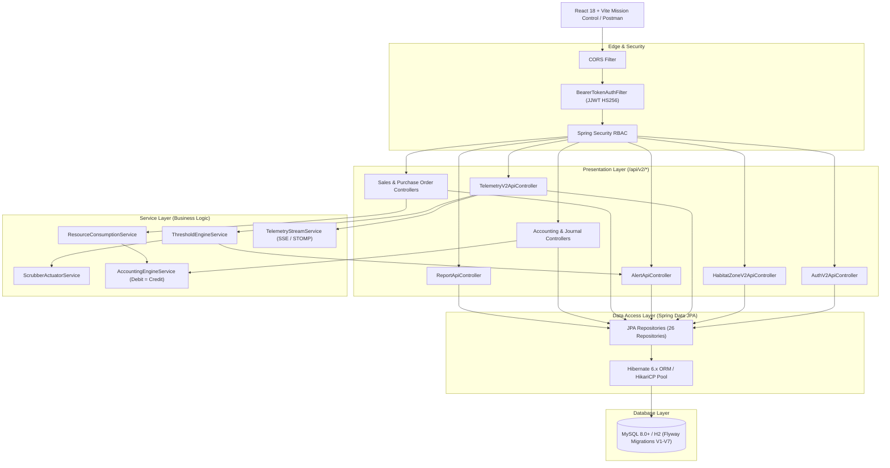

# System Architecture

The **Autonomous Lunar Habitat Environmental Control & Resource Reclamation Infrastructure (V2)** is designed as an enterprise-grade cyber-physical operations platform bridging environmental life-support sensors, autonomous control actuators, and strict double-entry ERP accounting.

---

## 🏛️ Multi-Tier Architecture Diagram

---

## 🧩 Architectural Components

### 1. Presentation Layer
- **V2 Mission Control Console:** React 18, TypeScript, Tailwind CSS, Lucide icons, Three.js 3D WebGL Digital Twin canvas.
- **REST API V2 Layer:** Standardized JSON endpoints under `/api/v2/*` with DTO validation (`@Valid`), RFC-7807 error responses, and Swagger OpenAPI 3.0 documentation.
- **Dual-Mode Real-Time Feeds:** Server-Sent Events (`/api/v2/telemetry/stream`) and Spring STOMP WebSockets (`/ws`, `/topic/telemetry`).

### 2. Security & Identity Layer
- **Stateless Cryptographic Tokens:** JJWT (HMAC-SHA256) access tokens (30m validity) and refresh tokens (7d validity).
- **Role-Based Access Control (RBAC):** Five operational roles (`ADMIN`, `HABITAT_OPERATOR`, `ACCOUNTANT`, `TENANT_USER`, `VIEWER`).
- **Session Revocation:** In-memory blacklist for immediate invalidation upon logout.

### 3. Core Business Services
- **Threshold Evaluation Engine:** Autonomous evaluation of pressure, temperature, humidity, CO₂, and water purity.
- **Automated Scrubber Actuator:** Automatically increases amine scrubber flow rate and fan speed upon critical hypercapnia detection.
- **Strict Double-Entry Accounting Engine:** Enforces the fundamental accounting balance $\sum \text{Debit} = \sum \text{Credit}$ on every transaction.
- **LUNAR CORE Intelligence:** Algorithmic composite stability index (0-100) scoring habitat health in real time.

### 4. Persistence & Database Layer
- **Flyway Migrations:** Version-controlled database schema migrations (V1 to V7) managing 27 relational tables.
- **Spring Data JPA / Hibernate:** Object-Relational Mapping with lazy loading, cascade rules, and HikariCP connection pooling.
