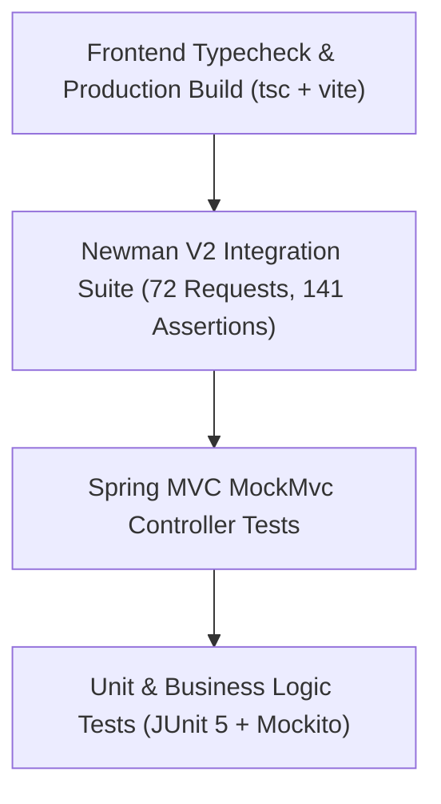

# Testing Strategy & Automated Quality Assurance

The Lunar Habitat platform incorporates end-to-end testing across unit, integration, API, security, and UI levels.

---

## 🧪 Testing Pyramid



---

## 📋 Test Suites & Commands

### 1. Backend JUnit 5 Tests
- **Framework:** JUnit 5, Mockito, Spring Boot Test, MockMvc.
- **Coverage:** 27 automated unit and integration tests covering:
  - JJWT cryptographic signature generation, rotation, tampered token rejection, and blacklist revocation (`src/test/java/com/lunar/habitat/controller/api/AuthApiControllerTest.java`).
  - Double-entry accounting balance enforcements (`AccountingEngineServiceTest.java`).
  - Invoice generation, line calculations, and posting (`InvoiceServiceTest.java`).
  - Payment reconciliation and bill settlement (`PaymentServiceTest.java`).
  - Budget variance calculations (`BudgetServiceTest.java`).
  - Environmental telemetry processing and threshold alerts (`TelemetryServiceTest.java`, `TelemetryApiControllerTest.java`).
- **Command:**
  ```bash
  mvn clean test
  ```
- **Result:** `Tests run: 27, Failures: 0, Errors: 0, Skipped: 0` (`BUILD SUCCESS`).

### 2. Postman / Newman Automated API Suite
- **Artifact:** `postman/Lunar_Habitat_V2_API.postman_collection.json`
- **Environment:** `postman/Lunar_Habitat_V2_Environment.postman_environment.json`
- **Scope:** 21 folders, 72 requests, 141 assertions testing end-to-end mission control operations.
- **Command:**
  ```bash
  npx --yes newman run "postman/Lunar_Habitat_V2_API.postman_collection.json" -e "postman/Lunar_Habitat_V2_Environment.postman_environment.json" --reporters cli
  ```
- **Result:** 72/72 requests passed, 141/141 assertions passed (100% pass rate, 0 failures).

### 3. Frontend TypeScript & Build Verification
- **Typecheck:** `npm run typecheck` (`tsc --noEmit`, 0 errors).
- **Lint:** `npm run lint`.
- **Production Build:** `npm run build` (`tsc && vite build`, 1668 modules bundled).
